# Hybrid Identity Migration Engineering (IAM-002)

**OmniVerse Enterprise Engineering Portfolio**

## Overview

This project documents an enterprise identity migration scenario involving cloud-only Microsoft Entra ID accounts, synchronized Active Directory identities, UPN migration, Soft Match, Hard Match, ImmutableID, Microsoft Graph automation, validation, and rollback planning.

IAM-002 builds on the hybrid identity platform established in IAM-001 by focusing specifically on migration engineering and identity matching.

## Business Scenario

OmniVerse Enterprises acquired an organization that already had Microsoft 365 cloud-only accounts before identity synchronization was standardized.

The objective was to merge existing cloud identities with synchronized Active Directory identities while preserving Microsoft 365 access, licenses, mailboxes, Teams data, OneDrive data, and user continuity.

## Environment

| Component | Value |
|---|---|
| Source Directory | Active Directory |
| Cloud Directory | Microsoft Entra ID |
| Sync Platform | Microsoft Entra Connect |
| Automation | PowerShell + Microsoft Graph |
| Migration Type | Cloud-only to hybrid identity |
| Matching Methods | Soft Match and Hard Match |
| Key Attribute | ImmutableID / Source Anchor |
| Validation | Graph, Entra, AD, CSV reports |

## Architecture

```text
Active Directory User
        |
        | ObjectGUID / UPN / proxyAddresses
        v
Microsoft Entra Connect
        |
        | Sync / Join / Export
        v
Microsoft Entra ID User
        |
        | License / Mailbox / Teams / OneDrive
        v
Validated Hybrid Identity
```

## Migration Walkthrough

### 1. Microsoft Entra Identity Audit
Before any migration activity, Microsoft Entra ID was audited to establish the current cloud identity state.

**Result:** Tenant successfully reviewed.

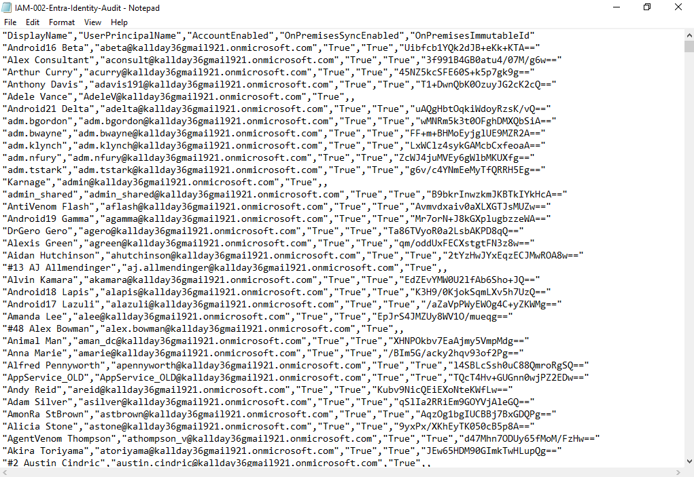

---

### 2. Migration Pilot Organizational Unit
A dedicated Migration Pilot OU was created in Active Directory.

**Result:** Pilot OU created.

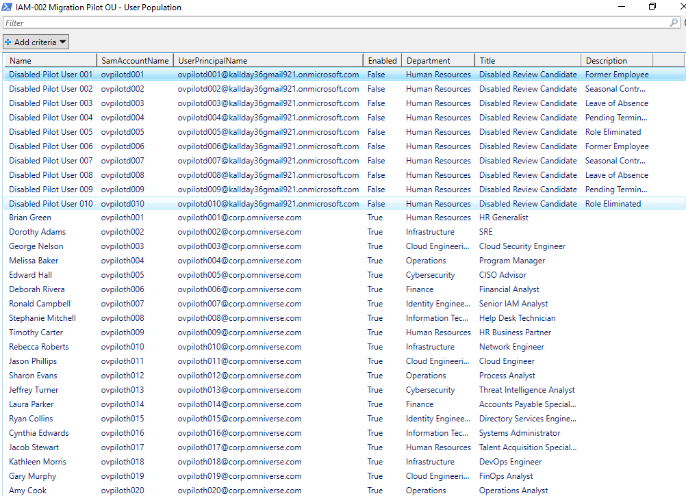

---

### 3. Soft Match Candidate Review
Soft Match candidates were reviewed using UPN, mail, and proxyAddresses.

**Result:** Soft Match candidates identified.

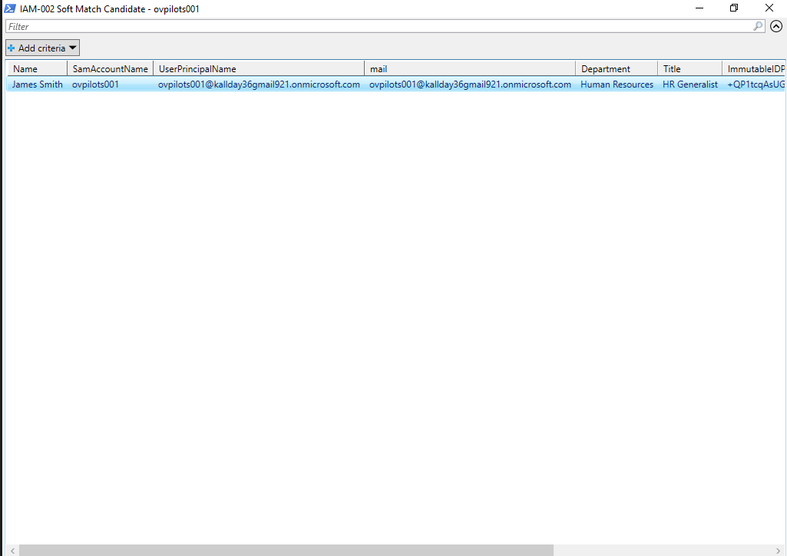

---

### 4. Hard Match Candidate Review
ObjectGUID converted to ImmutableID and applied to cloud objects.

**Result:** Hard Match candidates prepared.

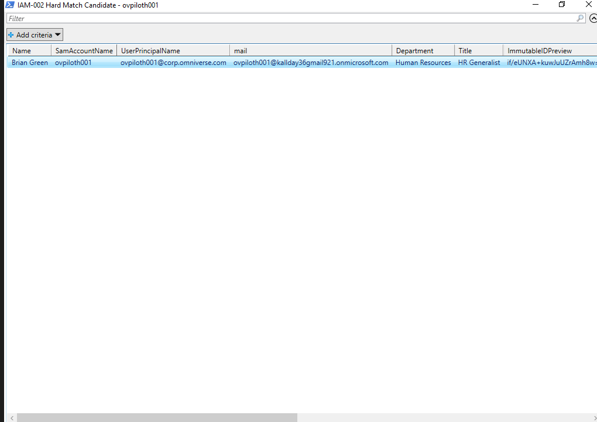

---

### 5. Disabled Review Candidate
Disabled cloud accounts reviewed to prevent conflicts.

**Result:** Disabled candidates identified.

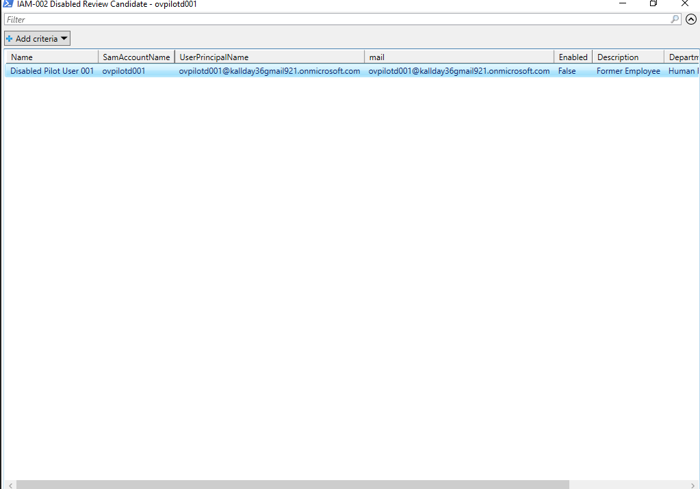

---

### 6. Cloud-Only User Review
Cloud-only users classified for migration.

**Result:** Cloud-only accounts classified.

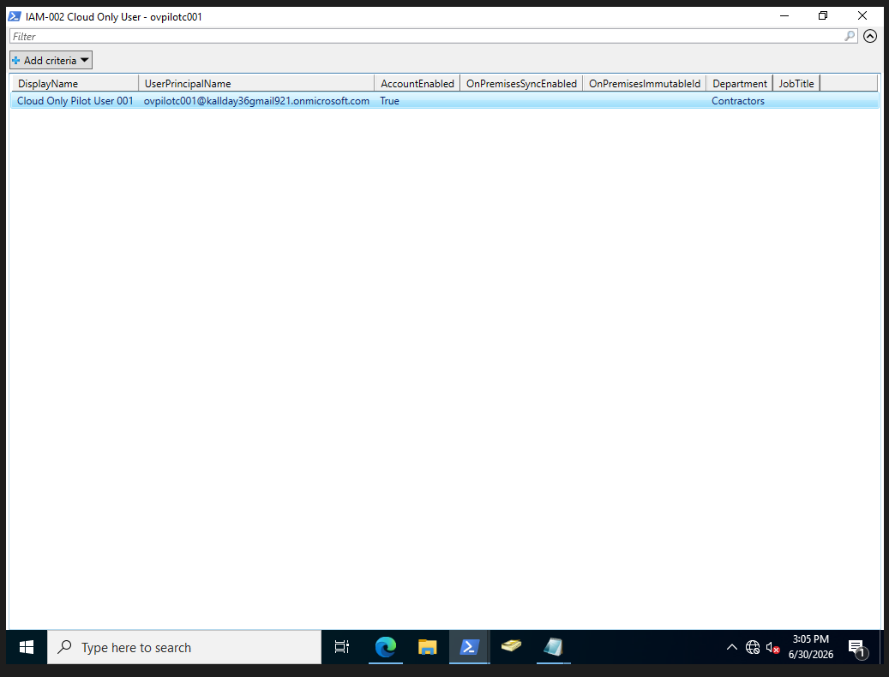

---

### 7. Discovery Classification
Users classified into migration buckets.

**Result:** Classification completed.

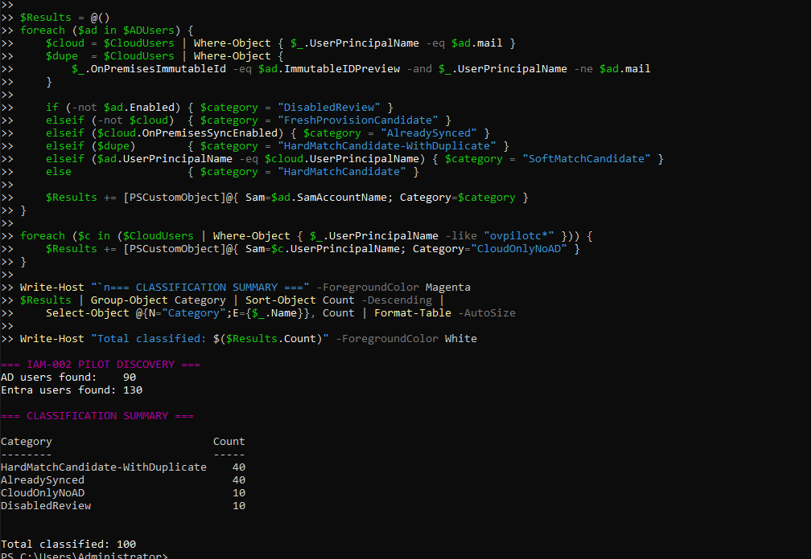

---

### 8. Pre-Flight Health Check
Graph connectivity, sync scheduler, DNS, and duplicate attributes validated.

**Result:** Environment ready.

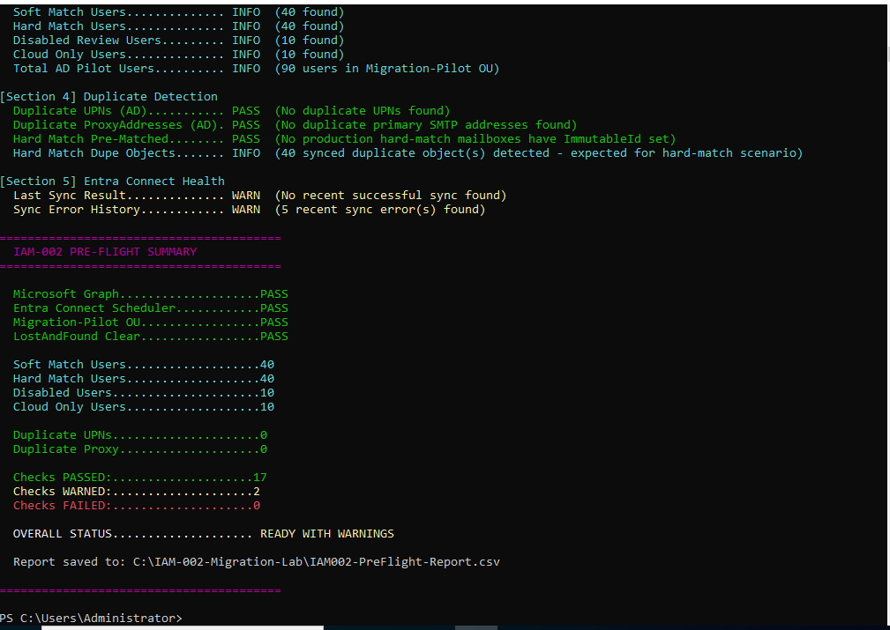

---

### 9. Hard Match Two-Object Pattern
Demonstrates cloud + AD duplicate identity pattern.

**Result:** Strategy preserved cloud identity.

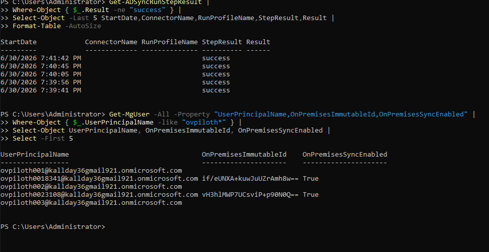

---

### 10. Hard Match Pilot Success
Pilot Hard Match validated migration logic.

**Result:** Pilot user matched.

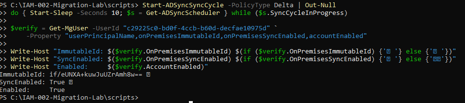

---

### 11. Hard Match Batch Summary
Final batch processed 40 users.

**Result:** 38 migrated, 2 skipped.

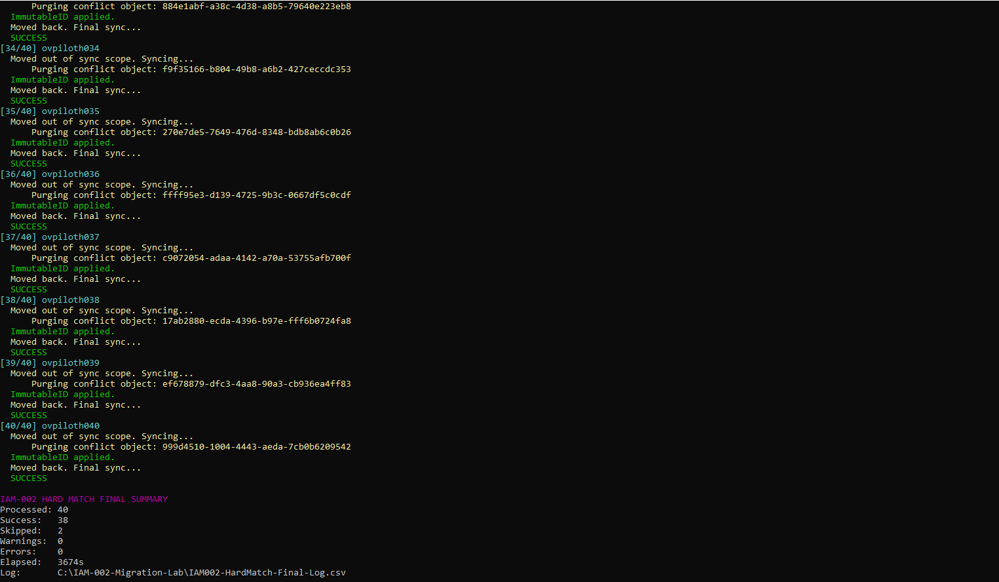

---

### 12. Post-Migration Validation
Validated ImmutableID, sync state, and account health.

**Result:** 40/40 PASS.

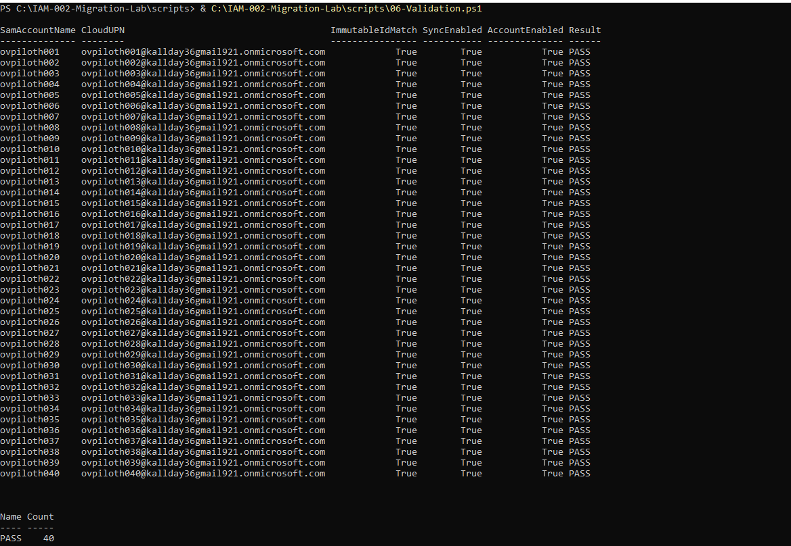

---

### 13. Rollback Validation
Rollback procedure validated.

**Result:** Rollback PASS.

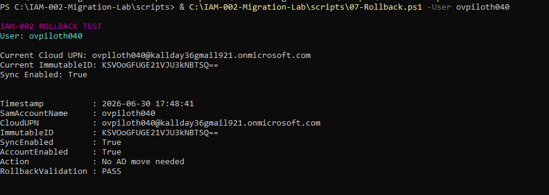

---

## PowerShell Automation

| Script | Purpose |
|--------|---------|
| 01-Identity-Audit.ps1 | Export identity data |
| 02-UPN-Migration.ps1 | Controlled UPN updates |
| 03-Soft-Match-Prep.ps1 | Prepare Soft Match |
| 03-HardMatch-Batch-Final.ps1 | Execute Hard Match batch |
| 04-Hard-Match-ImmutableID.ps1 | Convert ObjectGUID → ImmutableID |
| 05-Batch-Migration.ps1 | Batch migration framework |
| 06-Validation.ps1 | Validate migrated identities |
| 07-Rollback.ps1 | Rollback documentation |

## Final Results

| Metric | Result |
|--------|--------|
| Pilot Users | 40 |
| Successful Migrations | 38 |
| Skipped | 2 |
| Warnings | 0 |
| Errors | 0 |
| Validation | 40/40 PASS |
| Rollback | PASS |

## Troubleshooting Scenarios

* Cloud-only accounts  
* Duplicate objects  
* Duplicate UPN values  
* Duplicate proxyAddresses  
* Missing mail attributes  
* Incorrect ImmutableID  
* Soft Match failure  
* Hard Match requirement  
* Deleted object conflicts  
* Graph PATCH errors  
* Sync scope behavior  
* Export validation  

## Lessons Learned

* Pre-flight checks reduce risk  
* Deleted cloud objects block ImmutableID  
* Hard Match requires duplicate cleanup  
* Graph timing affects validation  
* Pilot migrations reduce risk  
* Rollback must be documented  

## Skills Demonstrated

* Microsoft Entra ID  
* Active Directory  
* Microsoft Entra Connect  
* Microsoft Graph  
* Soft Match / Hard Match  
* ImmutableID  
* UPN migration  
* Duplicate troubleshooting  
* Batch automation  
* CSV logging  
* Rollback planning  
* Enterprise migration documentation  

## Project Outcome

Successfully migrated cloud-only Microsoft 365 identities into synchronized hybrid identity while preserving access and minimizing risk.

## Future Enhancements

* Automated test harness  
* Advanced Graph reporting  
* License preservation  
* Teams / OneDrive validation  
* ServiceNow change record  
* Sentinel identity monitoring  

## Created By

**Keshawn Lynch**
